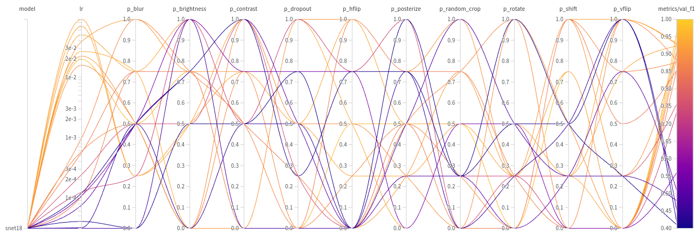
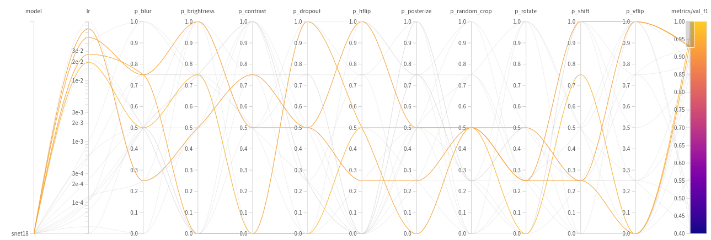
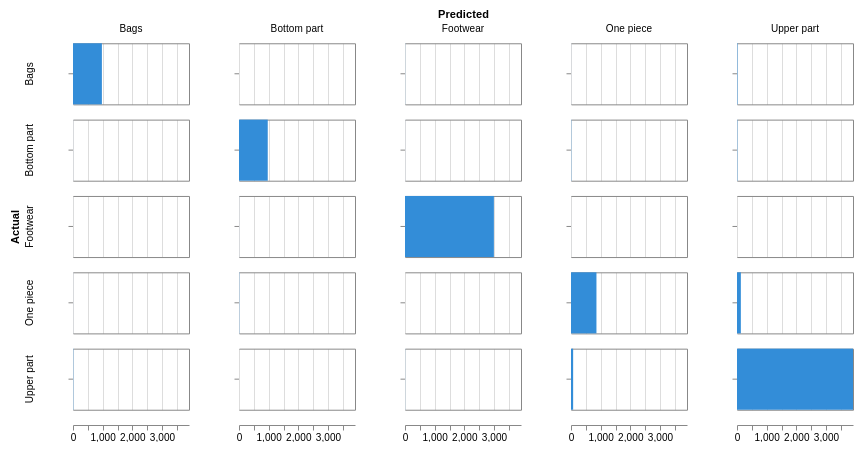
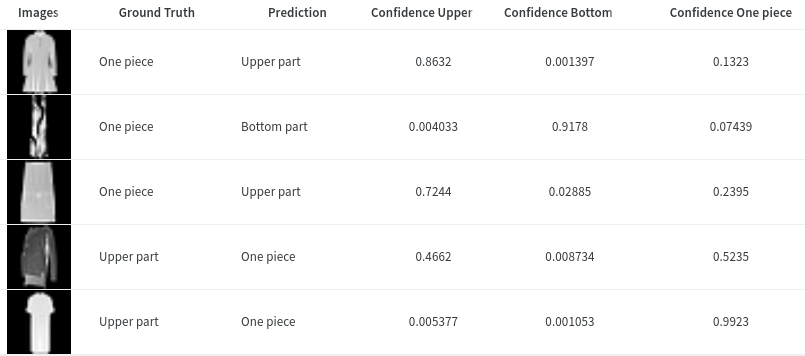
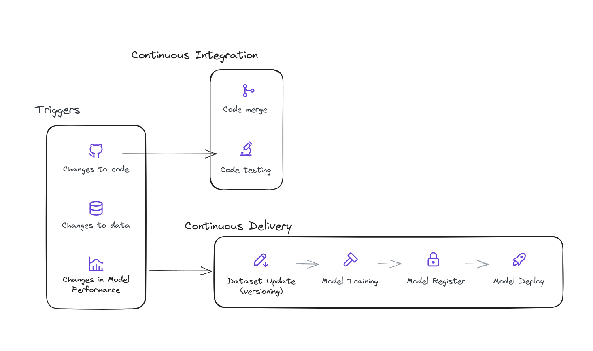
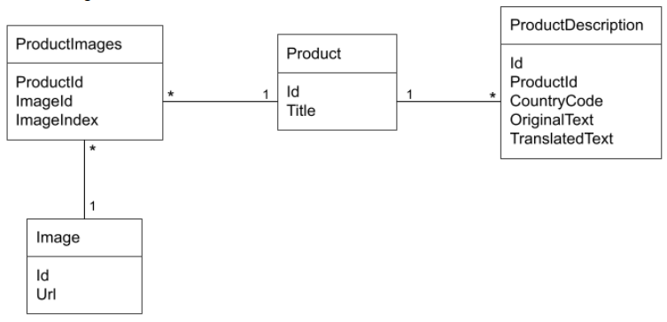
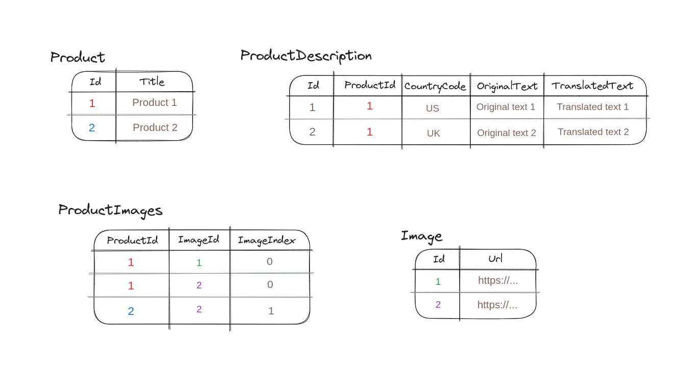

# Fashion MNIST Challenge

This repository contains the code for the Fashion MNIST challenge stated at [challenge.pdf](challenge.pdf).


## Code Structure

The structure of the code is the following:

```
├── README.md  <- The top-level README for developers using this project.
|
|
├── .vscode  <- Folder with the debugging configuration of the VSCode IDE
│
├── environments  <- Folder with the conda environment files for reproducibility
|   └── dev.yml   <- Conda environment file for development
│
├── etl  <- Folder with the code for data loading and pre/post-processing
|   ├── augmentation.py     <- Code for data augmentation
|   ├── dataset.py          <- Code for the dataset and dataloaders
|   └── normalization.py    <- Code for data normalization
│
├── miscellaneous  <- Folder with miscellaneous files
|   ├── challenge.pdf     <- File with the challenge description
|   ├── cicd.png          <- Image with the CI/CD deployment plan
|   ├── cm.png            <- Image with the confusion matrix test results
|   ├── errors.png        <- Image with the errors of the model in test set
|   ├── sql_example.png   <- Image with the SQL example data
|   ├── sql_schema.png    <- Image with the SQL schema
|   ├── sweep_filter.png  <- Image with the sweep filter
|   └── sweep.png         <- Image with the sweep results
│
├── models  <- Folder with the code for the models and training
|   ├── hub.py              <- Code for loading models from Timm
|   ├── losses.py           <- Code for the losses
|   ├── optimizers.py       <- Code for the optimizers
|   └── schedulers.py       <- Code for the optimizer schedulers
│
├── notebooks  <- Folder with the notebooks for the EDA and experiments
|   ├── data_augmentations.ipynb  <- Notebook with data augmentation exploration
|   ├── EDA.ipynb                 <- Notebook with the EDA
|   └── sql.ipynb                 <- Notebook with the SQL challenge solution
│
├── sweeps  <- Folder with the sweep configuration files
|   └── sweep_general.yaml  <- Sweep configuration file for a general sweep
│
├── .gitignore       <- File to ignore files and folders in git
├── arguments.py     <- Code for parsing the arguments
├── constants.py     <- Code with the constants of the project
│
├── core.py          <- Code with the core train and test functions
│
├── test.py          <- Script for testing a model
└── train.py         <- Script for training a model
```

## Setting up the environment

### Python environment

We are using virtual environments to manage the dependencies of our project, particularly, we are using [Anaconda](https://www.anaconda.com/) to create the virtual environments, with `Python 3.10`. Refer to the [official documentation](https://docs.conda.io/projects/conda/en/latest/user-guide/tasks/manage-environments.html) for complete instructions on how to create and manage virtual environments with Anaconda.

Once you have Anaconda installed, you can create a virtual environment with the following command:

```bash
conda env create -f environments/dev.yml
```

Then, you can activate the environment with:

```bash
conda activate centric_dev
```

### Environment variables
- `FASHION_DIR`: Path to the fashion dataset. If the dataset is not found, it will be downloaded to this path.
- `WANDB_API_KEY`: API key for W&B. You can find it in your W&B account settings or in your browser [here](https://wandb.ai/authorize).

#### How to set environment variables
- Linux: https://www.serverlab.ca/tutorials/linux/administration-linux/how-to-set-environment-variables-in-linux/
- Windows: https://www.architectryan.com/2018/08/31/how-to-change-environment-variables-on-windows-10/
- Mac: https://medium.com/@youngstone89/setting-up-environment-variables-in-mac-os-28e5941c771c

## Experiments

### Usage

You can use the next command as a template to run a training experiment:

```bash
python train.py \
  --model 'resnet18' \
  --save_dir 'runs' \
  --normalization '255' \
  --weights 'random' \
  --lr 0.01 \
  --batch_size 256 \
  --epochs 10 \
  --optimizer 'SGD' \
  --scheduler 'MultiStepLR' \
  --milestones '5-10' \
  --step_gamma 0.1 \
  --loss 'cross_entropy' \
  --val_size 0.15 \
  --num_workers 16 \
  --seed 42 \
  --p_rotate 0.5 \
  --p_posterize 0.5 \
  --p_shift 0.5 \
  --p_contrast 0.5 \
  --p_brightness 0.5 \
  --p_hflip 0.5 \
  --p_vflip 0.5 \
  --p_random_crop 0.5 \
  --p_blur 0.5 \
  --p_dropout 0.5
```

For running a test experiment, you can use the next command, replacing the `checkpoint` argument with the path to the checkpoint you want to test:

```bash
python test.py \
  --checkpoint 'runs/4b38f8e8-6c25-441d-9a7a-bc312ea33cfd/last_model.ckpt' \
  --normalization 255 \
  --batch_size 256 \
  --num_workers 16
```

### How to create a sweep

W&B [Sweeps](https://docs.wandb.ai/guides/sweeps) to automate hyperparameter search and visualize rich, interactive experiment tracking. Sweeps automatically run thousands of trials to efficiently find the best hyperparameters for our model.

We already defined a general sweep configuration in `jobs/sweep_general.yaml`. To run a sweep, we need to:

1. Initialize a sweep
```bash
wandb sweep --project centric-fashion-mnist sweeps/sweep_general.yaml
```

2. Start the sweep agent (we can find the sweep ID in the output of the previous command)
```bash
wandb agent <sweep-ID>
```

### How to proceed
1. Run a sweep with the general configuration
2. Analyze the results and decide which hyperparameters perform better
3. Train a model with the best hyperparameters, saving the checkpoint by using the `--save_dir` argument. Reduce the `val_size` to 0 to have all data for training. Train for more epochs.
4. Test the model with the best hyperparameters, loading the checkpoint by using the `--checkpoint` argument.


## Results

Initially, we ran a sweep with the general configuration. We obtained the following [results](https://api.wandb.ai/links/marioparreno/ck2mwtwf):



Which we can filter by selecting those with best `val_f1`:



And after analyzing the results, we decided to train a model with the following hyperparameters:

```bash
python train.py \
  --model 'resnet18' \
  --save_dir 'runs' \
  --normalization '255' \
  --weights 'random' \
  --lr 0.026 \
  --batch_size 256 \
  --epochs 50 \
  --optimizer 'SGD' \
  --scheduler 'MultiStepLR' \
  --milestones '17-35' \
  --step_gamma 0.1 \
  --loss 'cross_entropy' \
  --val_size 0 \
  --num_workers 16 \
  --seed 42 \
  --p_blur 0.65 \
  --p_brightness 0.7 \
  --p_contrast 0.5 \
  --p_dropout 0.3
  --p_hflip 0.5 \
  --p_vflip 0.2 \
  --p_posterize 0.15 \
  --p_random_crop 0.35 \
  --p_rotate 0.35 \
  --p_shift 0.35
```

Following the validation results, we should expect a `val_f1` of `0.96` and a `val_accuracy` of `0.96` on the test set. We obtained the following results:
- Test accuracy: `0.9707`
- Test F1: `0.9704`

We can see that the results are very close to the validation results, which means that we have a good model that generalizes well. Check [the report](https://api.wandb.ai/links/marioparreno/qvavv6wi) for interactive plots and more details. The confusion matrix for the test results is the following:



We can see how the 202 of 293 errors (~70%) come from a confusion between `One piece` and `Upper part`. This is because both classes have similar images, and the model is not able to distinguish between them: 



Maybe we could improve the model by adding more data augmentation techniques, or by using a more complex model. Also there is a possiblity that those classes are not separable, and we would need to redesign the classes.

## CI/CD Deployment Plan

> Design a CI/CD and deployment plan to serve the final model in a cloud based
production environment. This plan should include MLOps tools and KPIs
monitoring and we don't expect you to implement any code here.

### General Pipeline

An initial CI/CD deployment plan could be the following:


We have some triggers that will start the CI/CD pipeline:
- `Code changes in the repository`: For example if we add a new feature, we want to **test it** and deploy it.
- `Changes in the data source`: For example if we collect more data, we want to retrain the model and deploy it again.
- `Changes in the model performance`: For example if the model performance decreases due to a change in the data source, we want to retrain the model and deploy it again.

Those are some basic triggers, but we can add more triggers depending on the needs of the project. Then our continuous delivery pipeline will be executed, which will perform the following steps:
1. `Dataset Update`: If the data source has changed, we will update the dataset. For example if more data is collected, labeled or reviewed, we will update the dataset.
2. `Model Training`: We will train the model with the updated dataset. We will use the same hyperparameters found in an experimentation phase.
3. `Model Register`: We will register the model in a model registry. This will allow us to keep track of the different versions of the model. This will also include the model performance metrics and the hyperparameters used.
4. `Model Deployment`: If certain conditions are met, we will deploy the model. For example, if the model performance is better than the previous version, we will deploy the model. This will allow us to have a model in production that is always up to date.

### MLOps Tools

We will use the following MLOps tools:
- `GitHub`: We will use GitHub as our version control system. We will use the `main` branch as our main branch, and we will create a new branch for each new feature. We will also use GitHub to store our code and documentation.
- `GitHub Actions`: We will use GitHub Actions to automate our CI/CD pipeline. Here we can include the code testing and steps of the pipeline.
- `W&B`: We will use W&B to track our experiments and model performance. We will also use W&B to register our models in a model registry.
- `Docker`: We will use Docker to containerize our application. This will allow us to have a reproducible environment for our application.
- `Cloud Provider`: We will use a cloud provider to deploy our application. We will use the cloud provider to deploy our application in a scalable way. We will also use the cloud provider to monitor our application and to have a backup of our application. We can use our Docker image to deploy our application in the cloud provider.

### KPIs Monitoring

We will monitor the following KPIs:
- `Model performance`: We will monitor the model performance metrics. We will use W&B to track the model performance metrics. We will also use W&B to compare the model performance metrics between different versions of the model. The metrics can be the accuracy or the F1 score.
- `Model inference time`: We will monitor the model inference time. We will use W&B to track the model inference time. Depending on the application, we will have different requirements for the model inference time. For example, if we are using the model in a real-time application, we will need a low inference time.
- `Data drift`: We will monitor the data drift. For example, a photographer could change the camera they're using to photograph items, resulting in blurry or overly-dark photos.

## SQL Loading

Given the following SQL schema:



We need to write a query (either in django ORM or in SQL) to extract, for every existing product, the following fields:
- Product.Title
- Image.Url for the images with the ImageIndex = 0. *ImageIndex field states the priority order of images of a certain product. So for a given ProductId, the image with ImageIndex = 0 would be the most relevant image for that product.*
- ProductDescription.TranslatedText if exists, else ProductDescription.OriginalText for ProductDescriptions in CountryCode = ‘us’.

We created [notebooks/sql.ipynb](notebooks/sql.ipynb) to solve this problem, with some sample data.



The proposed solution is the following:

```python
res = []
for product in all_products:
    data = {"title": product.Title}
    data["descriptions"] = []
    data["images"] = []
    
    product_images = session.query(ProductImages).filter_by(ProductId=product.Id, ImageIndex=0).all()
    for product_image in product_images:
        image = session.query(Image).filter_by(Id=product_image.ImageId).first()
        data["images"].append(image.Url)

    product_descriptions = session.query(ProductDescription).filter_by(ProductId=product.Id).all()
    for description in product_descriptions:
        cc = description.CountryCode
        if description.TranslatedText:
            data["descriptions"].append({
                "cc": cc, "type": "translated", "text": description.TranslatedText
            })
        elif description.OriginalText and cc.lower() == "us":
            data["descriptions"].append({
                "cc": "us", "type": "original", "text": description.OriginalText
            })

    res.append(data)
```

Which will return the following result:

```json
[
    {
        "descriptions": [
            {
                "cc": "US",
                "text": "Translated text 1",
                "type": "translated"
            },
            {
                "cc": "UK",
                "text": "Translated text 2",
                "type": "translated"
            }
        ],
        "images": [
            "https://example.com/image1.jpg",
            "https://example.com/image2.jpg"
        ],
        "title": "Product 1"
    },
    {
        "descriptions": [],
        "images": [],
        "title": "Product 2"
    }
]
```

## Authors

For any questions, please contact at:

- Mario Parreño (maparla@proton.me)
